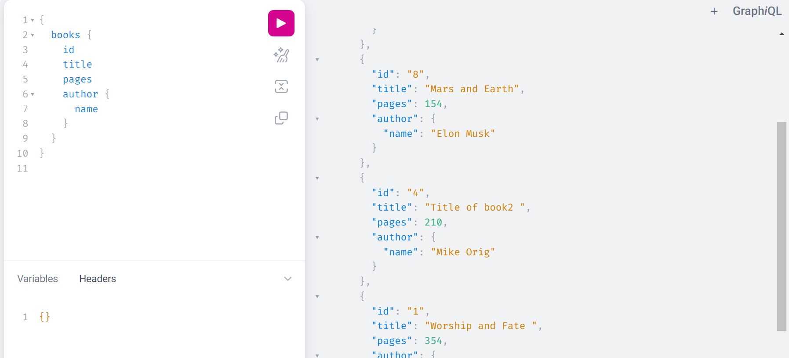
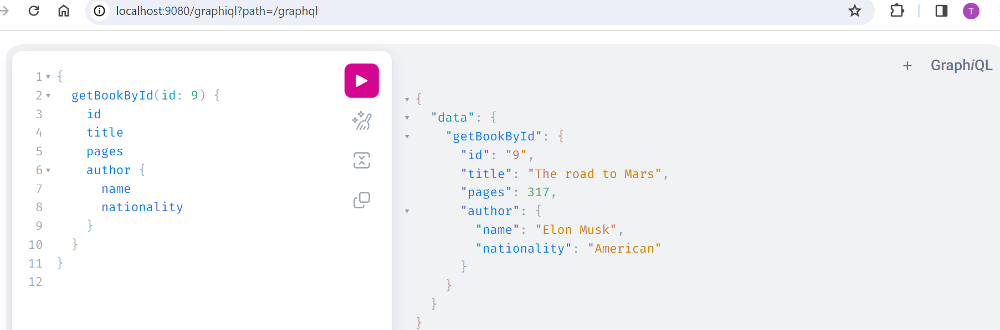
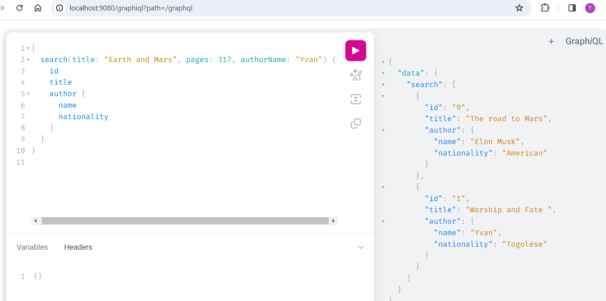

# GRAPHQL WITH SPRING-BOOT
## Description
This project named spring-graphql is an api that uses graphql technology. The main target is to use graphql
which is a query language to retrieve data from a server. It is as an alternative to REST, SOAP or gRPC.
The api exposes data about books and authors.

## Usage
- Clone the project from GitHub to your machine
````shell
    git clone https://github.com/Tountoun/spring-graphql.git
````
- Move to the project directory
````shell
    cd spring-graphql
````
- Install dependencies using maven
````shell
    mvn clean install
````
- Run the project on your IDE (IntelliJ IDEA for example) or using command
````shell
    mvn spring-boot:run
````
## Features
### Note: The schema of the response is specified by the client
- Get list of books



- Get a book by its id



- Search a book by its attribute; it is **or** search. The search keys are _title_, _pages_, _authorName_ and _nationality_.



## Documentation
Here is the official documentation of spring for graphql -> [check it](https://spring.io/guides/gs/graphql-server)

## Contact
- Feel free to join me at [tountounabela@gmail.com](mailto://tountounabela@gmail.com)